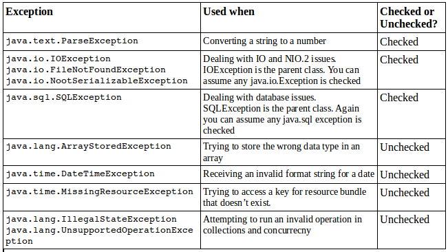

# Reviewing Exceptions
A program can fail for just about any reason. Here are a few posibilities commonly covered in OCP:
- Your program tries to read a file that doesn't exist.
- Your program tries to access a database, but the network connection to the database is unavailable.
- You made a coding mistake and wrote a wrong SQL statement in your JDBC code.
- You used a wrong format specifier when using DateTimeFormatter.

As you can see some are coding mistakes while others are completely beyond your control. If your network connection goes wrong there isn't much that you can do to deal with this situation.

## Exceptions Terminology
An *exception* is Java's way of saying "I give up. I don't know what to do right now. You deal with it".

## Categories of Exceptions
Below you can find the hierarchy of the exception classes. Rember that a *runtime exception* or unchecked exceptionmight be caught, but it is not requiered to be caught. A *checked exception* is any class that extends Exception but it is not a runtime exception. A checked exception must follow a declare a delcare rule where they either catch or throw an exception. An error is fatal and should never be caught. While it is legal to cathc an error it is not reccommended.


In red are the unchecked exception and in blue checked exceptions. 


## Exceptions on the OCP
- **ArithmeticException:** Thrown by the JVM when code attempts to divide by zero.
- **ArrayIndexOutOfBounds:** Thrown by the JVM when code uses an illegal index to access an array
- **ClassCastException:** Thrown by the JVM when an attempt is made to cast an object to a subclass of which it is not an instance.
- **IllegalArgumentException:** Thrown by the program to indicate that a method has been passed an illegal or inappropriate argument.
- **NullPointerException:** Thrown by the JVM when there is a null reference where an object is required.
- **NumberFormatException:** Thrown by the program when an attempt ismade to convert a string to numeric type, but the string an appropriate format..

You also learnt that *java.io.IOException* is an example of a checked exception. On the OCP you need to know more exceptions. The objectives cover a number of APIs that throw a mix of checked and unchecked exceptions. Just remember that IO, parsing, and SQL exceptions are checked. Anything else is a runtime exception unless the exam states otherwise.

See table below for further information:



## Try Statement
The try statement consists of a mandatory try clause. It can include one or more catch clause to handle the exception that are thrown. It can also include a finally clause, which runs regardless of whether the exception is thrown. This is true for both try and try-with-resources statements.

The syntax looks like below:

```
try{
  //protected code
}catch(exception indentifier){
  //exception handler
}finally{
  //finally block
}
```

A few notes on the try catch block. A finallt block can only appear as part of a try statement. The finally blok always executes whether or not an exception occurs in the try blocks. 

There is also a rule that says a try statement is required to have either or both the catch and finally clauses. This is true for try statements, but it is not true for try-with-resources statements. 

There are two other rules that you need remeber:
- Java checked the catch block in the order they appear. it is illegal to declare a subclass exception in a catch block that is lower down in the list than a super class exception because it will be unreachable code.
- Java will not allow you to declare a catch block for a checked exception type that cannot potentially be thrown by the try clause body. This is again to avoid unreacheable body.

## Throw vs Throws
The exam might try to trick you whether you are paying attention to the difference between throw and throws. Remember that throw means an exception is actually beign thrown and throws indicates that method merely has the potential to throw that exception. See code sample below:

```java
public String getDataFromDatabase() throws SQLException{
  throw new UnsupportedOperationException();
}
```


# Creating Custom Exceptions

## Using Multi-Catch

# Using Try-With-Resources
## Try-With_resource Basics
## AutoCloseable
## Suppressed Exceptions
## Putting It Together

# Rethrowing Exceptions

# Working with Assertions
## The assert Statement
## Enabling Assertions
## Using Assertions

