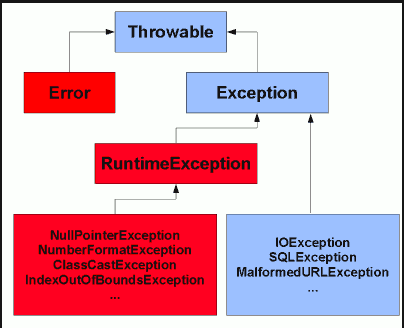

# Reviewing Exceptions
A program can fail for just about any reason. Here are a few posibilities commonly covered in OCP:
- Your program tries to read a file that doesn't exist.
- Your program tries to access a database, but the network connection to the database is unavailable.
- You made a coding mistake and wrote a wrong SQL statement in your JDBC code.
- You used a wrong format specifier when using DateTimeFormatter.

As you can see some are coding mistakes while others are completely beyond your control. If your network connection goes wrong there isn't much that you can do to deal with this situation.

## Exceptions Terminology
An *exception* is Java's way of saying "I give up. I don't know what to do right now. You deal with it".

## Categories of Exceptions
Below you can find the hierarchy of the exception classes. Rember that a *runtime exception* or unchecked exceptionmight be caught, but it is not requiered to be caught. A *checked exception* is any class that extends Exception but it is not a runtime exception. A checked exception must follow a declare a delcare rule where they either catch or throw an exception. An error is fatal and should never be caught. While it is legal to cathc an error it is not reccommended.

In red are the unchecked exception and in blue checked exceptions.

## Exceptions on the OCP
## Try Statement
## Throw vs Throws

# Creating Custom Exceptions

## Using Multi-Catch

# Using Try-With-Resources
## Try-With_resource Basics
## AutoCloseable
## Suppressed Exceptions
## Putting It Together

# Rethrowing Exceptions

# Working with Assertions
## The assert Statement
## Enabling Assertions
## Using Assertions

