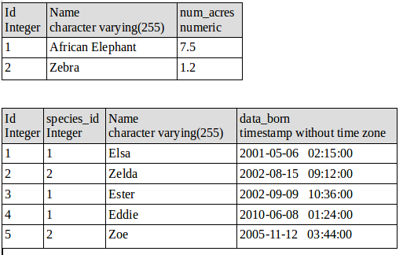

# Introducing Relational Databases and SQL
A *Database* is an organized collection of data. In the real world, a type cabinet is a type of database. A *relational database* is a database that is organized into tables, which consist of rows and columns. You can think of a table as a spreadsheet. There are two main ways to access a relational database from Java:
- Java Database Connectivity Language (JDBC): Accesses data as rows and columns. JDBC is the API covered in this chapter.
- Java Persistence API (JPA): Accesses data through Java objects using concept called object-relational mapping (ORM). The idea is that you don't have to write as much code, and you get your data in Java objects. JAP is not on the exam, and therefore it is not covered in this chapter.
- A relational database is accessed through Structured Query Language (SQL).
- In addition to relational database, there is another type of database called NoSQL database. This is for database that store their data in format other than tables. NoSQL is out of the scope for the exam as well.
- In the following  section, we introduce a small relational database that we will be using for the examples in this chapter and present the SQL to access it. We will also cover some vocabulary that you need to know.

## Indentifying the Structure of a Relational Database
Our smaple database has two tables. One has a row for each species that is in our zoo. The other has a row for each animal. These two relate to each other because an animal belong to a species. These relationships are why this type of databases is called a relational database. The figure below shows the structure if the database.

## Writing Basic SQL Statements

# Introducing the Interfaces of JDBC

# Connecting to a Database
## Building a JDBC URL
## Getting a Database Connection

# Obtaining a Statement
## Choosing a ResultSet Type
## Choosing a ResultSet Concurrency Mode

# Executing a Statement

# Getting Data from a ResultSet
## Reading a ResultSet
## Getting Data for a Column
## Scrolling ResultSet

# Closing Database Resources

# Dealing with Exceptions
